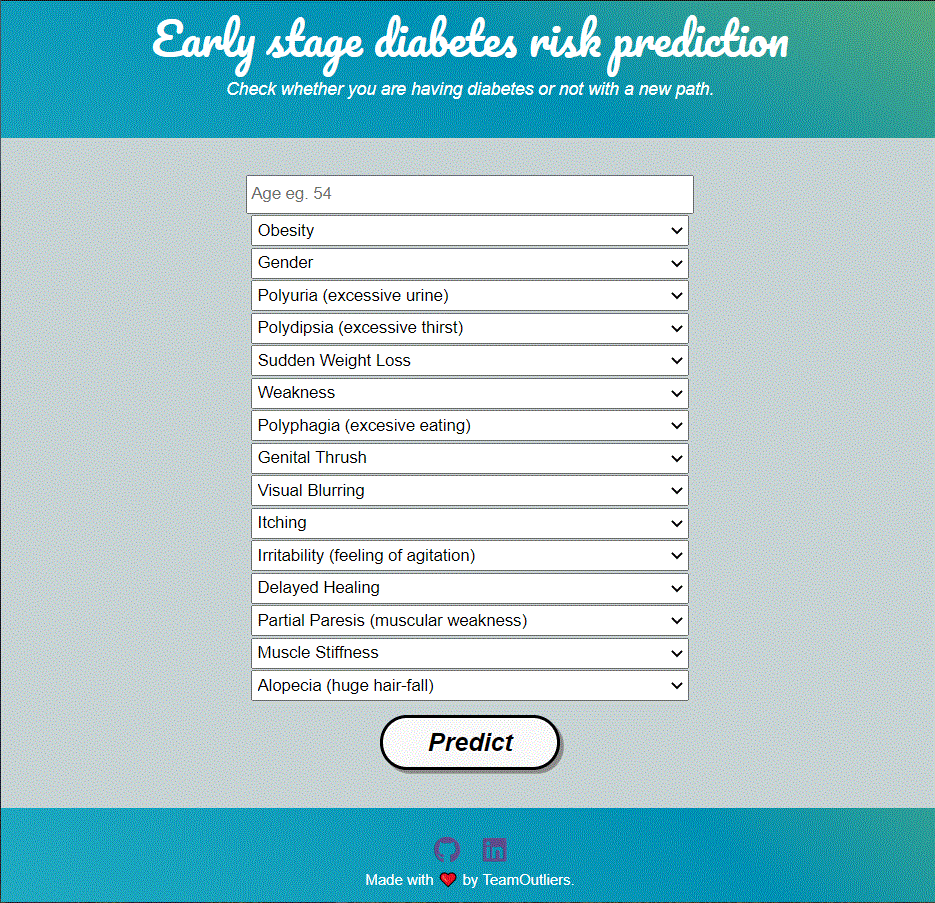

# Early Stage Diabetes Prediction - Deployed
 

• This repository consists of files required to deploy a ___Machine Learning Web App___ created with ___Flask___ on ___Heroku___ platform.

• Dataset link: https://archive.ics.uci.edu/ml/datasets/Early+stage+diabetes+risk+prediction+dataset.

• If you want to view the deployed model, click on the following link: 
Deployed at: https://early-diabetes-pred.herokuapp.com/
• Please do ⭐ the repository, if it helped you in anyway.

• A glimpse of the web app:

https://early-diabetes-pred.herokuapp.com/
